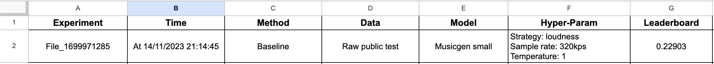
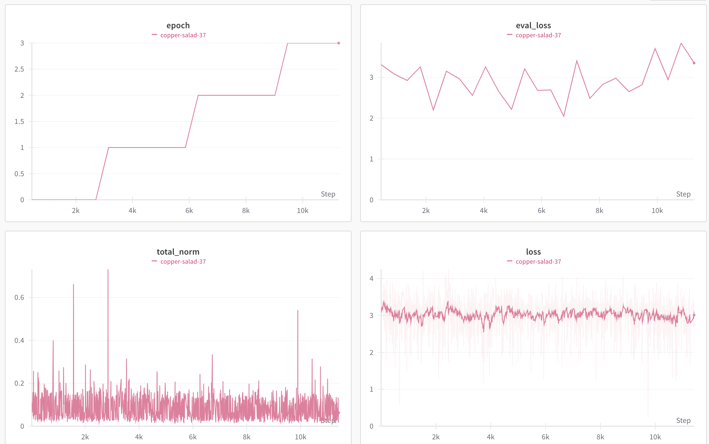
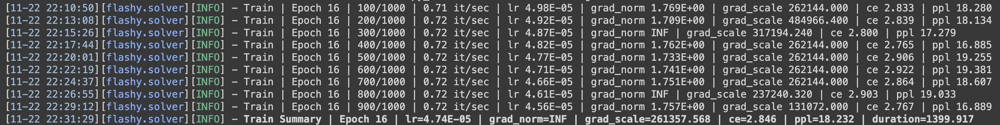
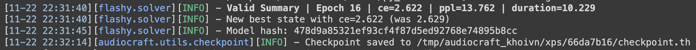
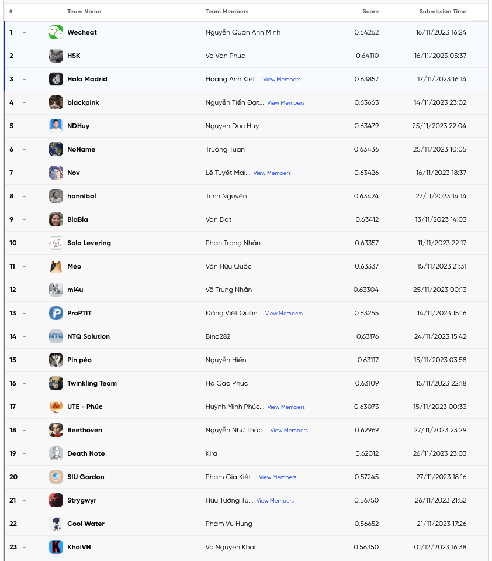

# Zalo AI Challenge 2023 - Background Music Generation

**Note**: [Google Drive](https://docs.google.com/presentation/d/1Fb-aK9yf4fk7CUiyPJmjsSsV7kSPXuBDkQExRmt-avU/edit?usp=sharing)

## Introduction
In the age of generative AI, the art of music composition is no longer confined solely to human composers. The AI music generation topic is designed to explore the creative potential of AI in the realm of background music creation. This challenge invites AI enthusiasts, data scientists, and musicians to harness the capabilities of AI to craft background music that enhances a myriad of contexts, from film and video games to advertising and online content.

## Problem statement
Within this challenge, participants are tasked with the development of AI systems capable of receiving textual descriptions as input and generating high-quality audio wave files as output. These AI systems will craft customized background music, considering various elements such as melody, hits, styles, and more to evoke the intended emotional and contextual resonance.

## Dataset
### Training data:
- A folder contains 10,000 music segments derived from 5,352 songs. Each segment consists of a 10-second audio clip of background music in the MP3 format with a 16 kHz frequency.
- A JSON file contains descriptions for the music segments, with each segment having one description in English text form.

### Testing data:
- Public test: consists of 1,000 descriptions in English text form, provided in a JSON file in the same format as the training data.
- Private test: consists of 2,000 descriptions in English text form, provided in a JSON file in the same format as the training data.

## Challenge details
Input: “A recording featuring a mellow piano melody, synth pad chords, punchy kick and snare hits, shimmering bells melody, groovy bass, and soft kick hits. The overall sound should be soft, mellow, easygoing, and emotional.”
Output: A 10-second audio file in mp3 format, tailored to meet the specified criteria.

## Evaluation criteria
The ultimate score is a combination of CLAP and FAS, known as the CLAS score. The CLAS score is calculated through a linear combination of CLAP and FAS, assigning equal weight, effectively averaging the two scores. The team with the highest CLAS score will be declared the winner.

CLAS = (CLAP + FAS) /2.

## Submission
The generated audios are stored in MP3 format, 10 seconds each file, and named accordingly to the description ID similarly to those provided in the training set.

All the generated audio files are put into a folder and submitted in ZIP format.

## Installation
```bash
pip install -r requirements.txt
```

Then, clone the Audiocraft repo:
```bash
git clone https://github.com/facebookresearch/audiocraft.git
```

## Solution
1. Use raw audio as input
2. Use Musicgen small pretrained model
3. Use Dora framework to train and evaluate
4. Use custom training script to train and evaluate
5. Augment dataset by creating 30s audio from 10s audio and resample to 32kHz
6. Fine-tune with custom dataset

## Baseline


## Prepare dataset
```bash
python prepare_data.py
```

## EDA
Details in `data.ipynb` and `EDA.ipynb`

Link Drive: https://docs.google.com/presentation/d/1Fb-aK9yf4fk7CUiyPJmjsSsV7kSPXuBDkQExRmt-avU/edit?usp=drive_link

## Augment dataset
```bash
python create_30s_audio.py
```

## Train and evaluate
### Train with custom model
```bash
python train --dataset_path data/train/dataset_train_val
```

**Options**:
- `dataset_path`: String, path to your dataset with `.wav` and `.txt` pairs.
- `model_id`: String, MusicGen model to use. Can be `small`/`medium`/`large`. Default: `small`
- `lr`: Float, learning rate. Default: `0.00001`/`1e-5`
- `epochs`: Integer, epoch count. Default: `100`
- `use_wandb`: Integer, `1` to enable wandb, `0` to disable it. Default: `0` = Disabled
- `save_step`: Integer, amount of steps to save a checkpoint. Default: None
- `no_label`: Integer, whether to read a dataset without `.txt` files. Default: `0` = Disabled
- `tune_text`: Integer, perform textual inversion instead of full training. Default: `0` = Disabled
- `weight_decay`: Float, the weight decay regularization coefficient. Default: `0.00001`/`1e-5`
- `grad_acc`: Integer, number of steps to smooth gradients over. Default: 2
- `warmup_steps`: Integer, amount of steps to slowly increase learning rate over to let the optimizer compute statistics. Default: 16
- `batch_size`: Integer, batch size the model sees at once. Reduce to lower memory consumption. Default: 4
- `use_cfg`: Integer, whether to train with some labels randomly dropped out. Default: `0` = Disabled



### Train with Dora framework
```bash
dora -P audiocraft run -d solver=musicgen/musicgen_base_32khz model/lm/model_scale=small continue_from=//pretrained/facebook/musicgen-small \
    conditioner=text2music  \
    dset=audio/default \
    dataset.num_workers=2 \
    dataset.valid.num_samples=1 \
    dataset.batch_size=2 \
    schedule.cosine.warmup=8 \
    optim.optimizer=adamw \
    optim.lr=1e-4 \
    optim.epochs=30 \
    optim.updates_per_epoch=1000 \
    optim.adam.weight_decay=0.01
```
Train:


Evaluate:


## Inference
```bash
python inference.py --json_path data/test/public_test.json --model_path models/ --output_dir output
```

or generate with custom model:

```bash
python generate.py --json_path data/test/public_test.json --weights_path models/
```

## App Demo
```bash
python demo.py
```

## Public Leaderboard

